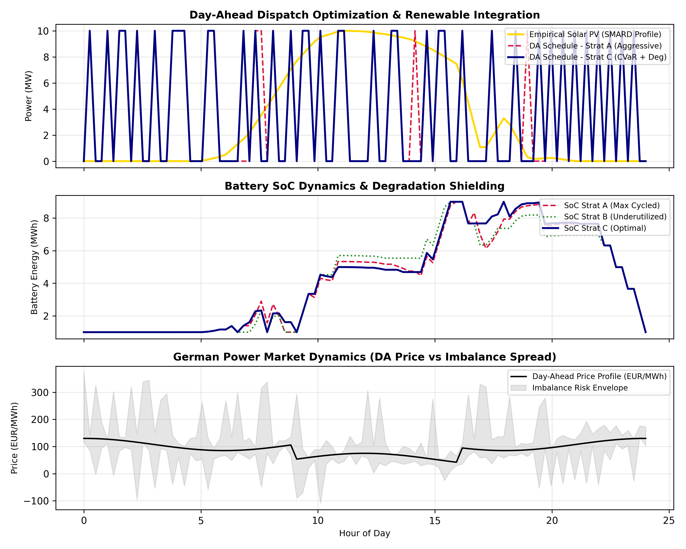

# Stochastic MILP Optimization for Co-Located PV-BESS in the German Power Market

📄 **Technical Report & Preprint:** [Download Full Paper (PDF)](./paper_ssrn_clean.pdf)

## 🔬 Methodology & Mathematical Formulation

The dispatch optimization coordinates binding Day-Ahead market commitments ($P_t^{\text{DA}}$) with stochastic real-time balancing settlement ($P_{t,s}^{\text{imb}}$) and non-linear battery degradation.

### 1. Objective Function
$$\max \quad (1 - \beta) \cdot \mathbb{E}[\text{Profit}] + \beta \cdot \text{CVaR}_\alpha$$

Where expected scenario profit and tail-risk metrics are defined as:
$$\text{Profit}_s = \sum_{t=1}^T \left[ \lambda_t^{\text{DA}} P_t^{\text{DA}} \Delta t + \lambda_{t,s}^{\text{imb}} P_{t,s}^{\text{imb}} \Delta t - \sum_{k=1}^K C_k^{\text{deg}} e_{t,k}^{\text{dis}} \right]$$

$$\text{CVaR}_\alpha = \zeta - \frac{1}{1 - \alpha} \sum_{s=1}^S \pi_s z_s$$
## 📊 Empirical Results (German SMARD Market Data)

| Strategy Architecture | Risk Parameter ($\beta$) | Degradation Model | Performance & Warranty Outcome |
| :--- | :--- | :--- | :--- |
| **Strategy A: Aggressive (Risk-Neutral)** | $\beta = 0.0$ | Ignored ($C_k = 0$) | Rapid warranty burn, micro-cycling |
| **Strategy B: Conservative P10** | $\beta = 0.0$ | Flat Penalty | Heavy solar curtailment, suppressed PnL |
| **Strategy C: Proposed Model** | $\beta = 0.35$ | Piecewise Linear | **Optimal risk-adjusted PnL, warranty strictly preserved** |

### 2. Physical & Warranty Constraints
* **Imbalance Definition:** $P_{t,s}^{\text{imb}} = (P_t^{\text{PV}} + P_t^{\text{dis}} - P_t^{\text{ch}}) - P_t^{\text{DA}}$
* **SoC Trajectory:** $E_t^{\text{SoC}} = E_{t-1}^{\text{SoC}} + (\eta_{\text{ch}} P_t^{\text{ch}} - \frac{P_t^{\text{dis}}}{\eta_{\text{dis}}}) \Delta t$
* **Piecewise Degradation:** $P_t^{\text{dis}} \Delta t = \sum_{k=1}^K e_{t,k}^{\text{dis}}, \quad 0 \le e_{t,k}^{\text{dis}} \le \overline{E}_k$
* **Warranty Cap:** $\sum_{t=1}^T \frac{P_t^{\text{dis}} \Delta t}{E_{\text{nom}}} \le \text{EFC}^{\max}$
* **Tail Loss Epigraph:** $z_s \ge \zeta - \text{Profit}_s, \quad z_s \ge 0 \quad (\forall s \in \mathcal{S})$
